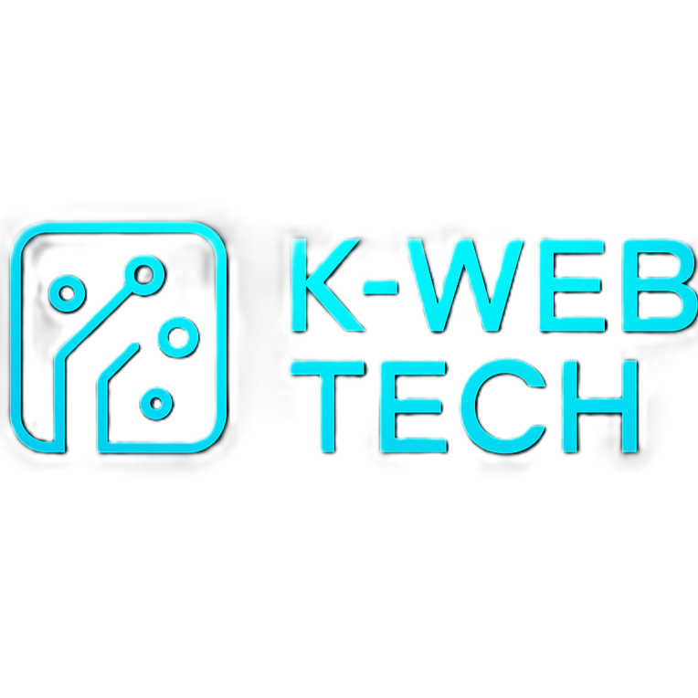

# 🚀 K-Web Tech — Creative Digital Web Platform

Welcome to **K-Web Tech**, a sleek and modern frontend web application designed to showcase creative digital solutions. Built with **React**, **Tailwind CSS**, **Framer Motion**, and more, the platform highlights stunning UI/UX, smart animations, blog content, and restricted user access features.

🌐 **Live Site**: [https://k-web-tec.web.app](https://k-web-tec.web.app)

---

## 📸 Project Preview


---

## ✨ Features

### ✅ General Features

- ⚡ Lightning-fast performance with **Vite**
- 🎨 Stylish, responsive design with **Tailwind CSS**
- 🌙 Dark theme & gradient-rich UI
- 🌀 Animated transitions using **Framer Motion**
- 🧩 Component-based architecture (reusable & modular)
- 🔒 Secure private routes for logged-in users only
- 🔁 Auto-scroll banners with **react-fast-marquee**
- 🧠 Scroll-based effects and modern reveal animations

---

### 📄 Pages Included

| Page                  | Description |
|-----------------------|-------------|
| **Home**              | Hero banner, intro, services, and logos slider |
| **About Us**          | Creative layout introducing the platform or team |
| **Projects**          | Showcases featured work with hover effects |
| **Blog**              | Informative blog cards with category filtering |
| **Blog Details**      | Full blog with likes, sidebar, and sticky layout |
| **Login / Register**  | Firebase Auth (email & Google) integration |
| **Profile**           | User info, role display, email verification info |
| **Admin Dashboard**   | Role-based dashboard access |
| **Private Pages**     | Access restricted to logged-in users |
| **Under Construction**| Creative 404/Coming Soon placeholder |

---

## 🔐 Authentication

- 🔑 Firebase Authentication (Email/Password + Google)
- 🔄 Auth state is globally managed via context
- 🧭 Conditional rendering for login-only routes

---

## 🛠 Technologies Used

| Tech                | Description |
|---------------------|-------------|
| **React.js**        | UI Library |
| **Tailwind CSS**    | Utility-first CSS |
| **Framer Motion**   | Smooth animations |
| **React Icons**     | Icon components |
| **React Router DOM**| Client-side routing |
| **Firebase**        | Hosting + Auth |
| **SweetAlert2**     | Alert modals |
| **React Awesome Reveal** | Scroll reveal animations |
| **React Fast Marquee** | Infinite auto-scroll logos |

---

## 📦 Folder Structure

```

src/
│
├── components/       # Shared components (Navbar, Loader, Cards)
├── pages/            # Page-level components (Home, Blog, Projects, etc.)
├── routes/           # Protected routes
├── hooks/            # Custom hooks (useAuth, etc.)
├── assets/           # Static images and logos
├── CSS/              # Custom stylesheets
├── App.jsx           # Main app component
├── main.jsx          # App entry point
└── firebase.config.js# Firebase setup

````

---

## 🚀 Getting Started

```bash
git clone https://github.com/kamrul2006/k-web-tech.git
cd k-web-tech
npm install
npm run dev
````

---

## 🚚 Deployment

This project is deployed using **Firebase Hosting**.

To deploy:

```bash
npm run build
firebase login
firebase init
firebase deploy
```

---

## 🙋‍♂️ Author

**Kamrul Islam Apurba**
Frontend Developer | [GitHub](https://github.com/kamrul2006)

---

## 📄 License

This project is licensed under the [MIT License](LICENSE).

---

> Feel free to fork, contribute, or raise issues. Feedback is always welcome!
