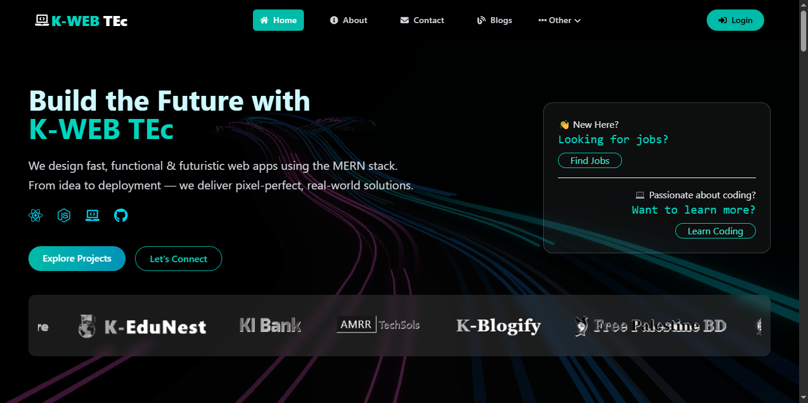

# 🚀 K-Web Tech — Creative Digital Web Platform

-----


Welcome to K-Web Tech, a sleek and modern frontend web application designed to showcase creative digital solutions. Built with React, Tailwind CSS, Framer Motion, and more, the platform highlights stunning UI/UX, smart animations, blog content, and restricted user access features.


## 🔗 Live Demo
👉 [Visit K-Web Tech](https://k-web-tec.web.app)

---

## 🖼️ Project Preview



---

## ✨ Features

### 🧰 Core Highlights

* ⚡ Fast & optimized with **Vite**
* 🎨 Styled using **Tailwind CSS**
* 🌒 Dark mode with gradient-rich UI
* 🌀 Page transitions via **Framer Motion**
* ♻️ Reusable, modular **React components**
* 🔒 Firebase-based secure route protection
* 🔁 Marquee banners for brands & projects
* 👀 Scroll-reveal & animation interactions

---

### 📄 Pages Overview

| 📌 Page          | 🔍 Description                     |
| ---------------- | ---------------------------------- |
| Home             | Hero + sections + logo carousel    |
| About Us         | Team or platform intro layout      |
| Projects         | Interactive featured cards         |
| Blog             | Blog listings with filters         |
| Blog Details     | Post with sidebar, likes           |
| Login / Register | Firebase Auth with email & Google  |
| Profile          | User info & verification           |
| Admin Dashboard  | Role-based admin routes            |
| Private Routes   | Accessible only to logged-in users |
| 404/Coming Soon  | Creative placeholder design        |

---

## 🔐 Authentication

* ✅ Email/password login
* 🌐 Google sign-in (OAuth)
* 🎯 Global auth context
* 🧾 Conditional rendering for protected content
* 📩 Email verification support

---

## 🛠️ Built With

| 🔧 Tool / Tech       | 🧩 Purpose            |
| -------------------- | --------------------- |
| React.js             | Frontend UI           |
| Tailwind CSS         | Styling               |
| Framer Motion        | Animations            |
| React Router DOM     | Client routing        |
| Firebase             | Auth & hosting        |
| React Icons          | SVG icons             |
| SweetAlert2          | Modal alerts          |
| React Awesome Reveal | Scroll reveal effects |
| React Fast Marquee   | Smooth auto scroll    |

---

## 📂 Project Structure

<details>
<summary>Click to view folder tree</summary>

```
src/
│
├── components/       # Navbar, Cards, Loader, etc.
├── pages/            # Page-specific React components
├── routes/           # Route protection & private logic
├── hooks/            # Custom React hooks
├── assets/           # Static assets (images, SVGs)
├── CSS/              # Optional custom stylesheets
├── App.jsx           # App shell and layout
├── main.jsx          # Root app renderer
└── firebase.config.js# Firebase setup file
```

</details>

---

## 🧪 Quick Start

### 🔧 Local Development

```bash
git clone https://github.com/kamrul2006/K-WEB-TECH-UI.git
cd k-web-tech
npm install
npm run dev
```

---

## 🚀 Deployment Guide

This project uses **Firebase Hosting**.

### 🔄 Deploy Commands

```bash
npm run build
firebase login
firebase init
firebase deploy
```

> Ensure you’ve installed Firebase CLI:

```bash
npm install -g firebase-tools
```

---

## 👤 Author

**Kamrul Islam Apurba**
Frontend Developer

* 🌐 [GitHub](https://github.com/kamrul2006)
* 📧 [kamrulislamapurba@gmail.com](mailto:kamrulislamapurba@gmail.com)

---

## 📄 License

This project is licensed under the [MIT License](LICENSE).

---

## 🤝 Contributing

Contributions are welcome!

* 🪄 Fork the repo
* 🛠 Create a new branch
* ✅ Submit a pull request

> Found a bug or have a suggestion? [Open an issue](https://github.com/kamrul2006/K-WEB-TECH-UI/issues)

---

<p align="center">
  <a href="https://github.com/kamrul2006/K-WEB-TECH-UI"></a>
  <a href="https://github.com/kamrul2006/K-WEB-TECH-UI"></a>
  <a href="https://github.com/kamrul2006/K-WEB-TECH-UI/blob/main/LICENSE"></a>
</p>

<p align="center">
  <a href="https://github.com/kamrul2006/K-WEB-TECH-UI"></a>
</p>

## 📣 Acknowledgements

* 🔥 [Vite](https://vitejs.dev)
* ✨ [Framer Motion](https://www.framer.com/motion/)
* 🎨 [Tailwind CSS](https://tailwindcss.com)
* ☁️ [Firebase](https://firebase.google.com/)

---

